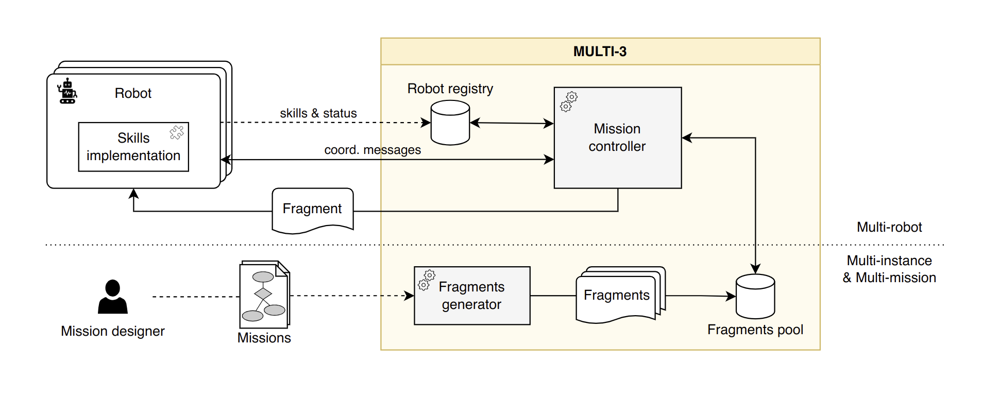
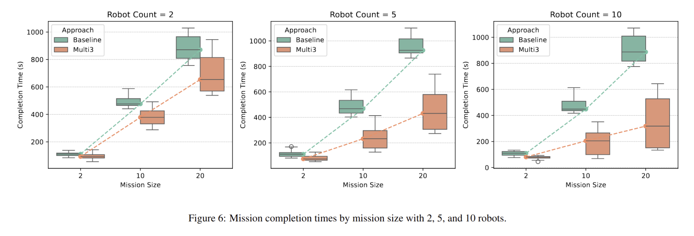

# Multi-3: Adaptive Robot Coordination
Replication package for the paper **Multi-3 Adaptive Coordination of Robots**

## Authors
This study has been designed, developed and reported by the following researchers:
- Juan Antonio Piñera García (Gran Sasso Science Institute, Italy)
- Gianluca Filippone (Gran Sasso Science Institute, Italy)
- Marco Autili (University of L'Aquila, Italy)
- Patrizio Pelliccione (Gran Sasso Science Institute, Italy)


## Repository Structure
```
multi3_real
|   README.md                      # This file
|---analysis                       # Notebooks to analysis the logs and produce results            
|---output                         # Files generated from executing the test cases 
|---coordinator                    # Docker Container implementing the coordinator component
|   ├---multi3_coord_ws
|   |    └---src
|   |       ├---multi3_coordinator # ROS2 package implementing the coordinator
|   |       └---multi3_tests # ROS2 package containing scripts for the generation of test cases
|   ├   Dockerfile           # Dockerfile describing the building of the coordinator container
|   └   entrypoint.sh
|---executor
    ├---setup
    ├---multi3_exec_ws
    |    └---src
    |       ├---multi3_executor # ROS2 package implementing the coordinator
    |       └---multi3_tests  # ROS2 package containing scripts for the generation of test cases
    ├   Dockerfile           # Dockerfile describing the building of the coordinator container
    └   entrypoint.sh
```

## Approach


Multi-3 is a framework for executing multiple missions (multi-missions) with multiple instances of the same
task (multi-instance) using multiple robots (multi-robots). 
- At the specification level, it enables the definition of missions with multi-
instance tasks. 
- At the execution level, the runtime support permits the execution of multiple missions at a time, while the adaptive
coordination of the involved robots allows them to dynamically switch across tasks of multiple missions or multiple task instances.

We validate the solution at work on a set of multi-robot systems scenarios in different domains. The results show that
Multi-3 is viable, reduces the robots’ idle time, and effectively allows the execution of multiple missions at a time.

### Experiments Results


## Experiment Replication 

### Requirements
- Docker 
- Python 3.9+

### Test Case Generation

One of the main components of Multi3 is the decomposition of the global mission specification into fragments to enable an efficient and dynamic task execution during runtime. The script that implements the fragment generation can be found at `coordinator/multi3_coord_ws/src/multi3_tests/multi3_tests/gen_fragments.py`.

To generate the test cases, we use a JSON file at `coordinator/multi3_coord_ws/src/multi3_tests/multi3_tests/config/test_config.json`. 
Here we can see the following structure:
```
{
    "robot_counts": [2,5,10],
    "mission_sizes": [2,10,20],
    "inventory_sample_size": 3,
    "bl_assignment_sample_size": 3,
    "scenarios": ["t_agriculture","t_surveillance","t_cleaning","t_logistics"]
}
```
This file references the different scenarios,pointing to different mission specifications, which can be found at `coordinator/multi3_coord_ws/src/multi3_tests/multi3_tests/tasks`.

#### Generating test cases (Optional - Requires ROS2)
Once the test configuration has been set, we can generate more tests by executing:
```
ros2 run multi3_tests generate
```

### Simulation
To execute the simulation, we run the `auto_test.py` script, which inspects the tests folder inside of `coordinator/multi3_coord_ws/src/multi3_tests/multi3_tests/tests`:

```
python3 auto_test.py
```

This script first creates one Docker Compose file per every test that will be run, describing the configuration of the containers that will need to be created for Multi3, this amount is 1 Coordinator + N executors (depends on the robot count of the particular test).

Afterwards, it proceeds to execute each of the test cases, one by one, by executing the corresponding docker-compose file.

The output logs of the test cases can be found in `/output/test_logs`.


### Analysis and Results
In order to perform the analysis, the script in `analysis/analyze.py` inspects the logs generated as a result of running the test cases and extracts the relevant information i.e mission completion times and average idle times for each test case.

```
cd analysis/
python3 analyze.py
```

After this file generates a JSON file with the data from the tests, we use a script to convert this data into a CSV file, to be able to do data processing with Pandas.

```
python3 data_analysis.py
```

Finally, we use a Jupyter notebook to inspect the results and generate the graphs.

```
jupyter notebook time_analysis.ipynb
```

The logs generated from running the test cases can be found at `output/test_logs`. The data obtained from the logs can be found in `output/data.csv`


### Real World execution

To execute the Multi-3 platform with real robots, we need to adjust the docker compose file to correctly reference the ROS2 ecosystem of each robot. To do this we can edit the file at `docker_files/docker-compose-real.yaml`. As an example, the file should include:

```
services:
  coordinator:
    build: ./coordinator
    environment:
      - ROS_DOMAIN_ID=55
      - MODE=multi3
      - TEST_ID=<TEST_ID>
    volumes:
      - ./output:/multi3_coord_ws/src/multi3_tests/multi3_tests/results
    container_name: coordinator
    network_mode: host 

  executor1:
    build: ./executor
    container_name: executor1
    environment:
      - DISPLAY=${DISPLAY}
      - ROBOT_PORT=6001
      - EXECUTOR_ID=executor1
      - ROBOT_NAME=<ROBOT_NAME>
      - TB_ID=<ROBOT_NAMESPACE>
      - ROS_ENV=ros_humble
      - ROS_DOMAIN_ID=<ROS_DOMAIN_ID>
      - COORDINATOR_URL=http://localhost:5000
      - TEST_ID=<TEST_ID>
    volumes:
      - /tmp/.X11-unix:/tmp/.X11-unix
    depends_on:
      - coordinator
    network_mode: host 
    privileged: true

    ...
```
The values corresponding to `ROBOT_NAME`, `ROBOT_NAMESPACE`,`ROS_DOMAIN_ID` and `TEST_ID` must be filled according to the real robot system to be deployed

### Battery Consumption Analysis
During the execution of the real tests, we recorded the battery consumption using Multi-3 and compared it with the baseline. The data from the experiments can be found at `output/real_tb4_tests`. The notebook at `analysis/battery_analysis.ipynb` analyses the data and generates the graphs.

